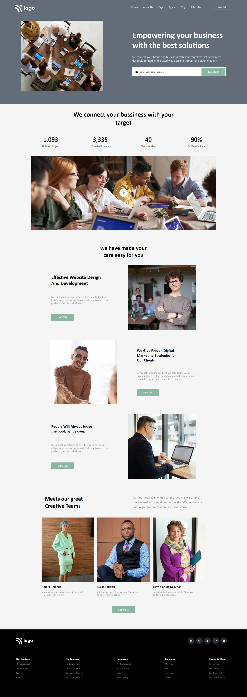

# Mohan Chindam

- This project's web page design was easier than the last web page that I designed.
- Strategizing the things to write proper HTML improved.
- Tried using CSS object properties in image tags.
- Thought process of designing the web page has been improved a lot.
- Improved some of the skills better in this project.
- It took nearly five to five and half hours to complete this project.
- Enjoyed it a lot as I tried to design a page. Flexbox made things easier.

- Below image shows the preview of the project:

I deployed the project on **Netlify**:
- You can preview the project here, [**Business Landing Page**]()

